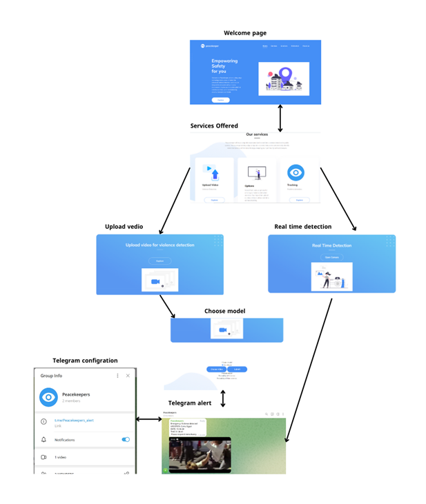

# Peacekeeper Violence Detection System

## Overview
Peacekeeper is an advanced violence detection system designed to enhance safety and security in public spaces. Utilizing cutting-edge computer vision and deep learning techniques, Peacekeeper provides real-time monitoring and detection of violent incidents in surveillance video feeds. The system can be integrated with existing security infrastructures and offers customizable alert settings to ensure timely responses to potential threats.

## Key Features
- **Real-Time Surveillance Video Analysis:** Instant detection and alerts for violent incidents.
- **Integration with Existing Security Infrastructure:** Seamless compatibility with current systems.
- **Customizable Alert Settings:** Tailor alert notifications to meet specific security needs.
- **Robust Data Privacy and Ethical AI Practices:** Commitment to ethical AI use and data protection.
- **Extensive Field Testing and User Feedback:** Continuous improvement based on real-world usage and feedback.

## Technologies and Methodologies
- **Deep Learning Models:** CNN-LSTM, LSTM, and ConvLSTM for violence detection.
- **Computer Vision Techniques:** YOLO for pose detection.
- **Human Pose Estimation:** Extractors and change detectors.
- **Traditional Machine Learning Techniques:** SVM for classification and activity recognition.
- **Data Collection and Datasets:** RWF-2000 dataset for training and validation, Real Live Violence Detection dataset for testing.
- **Real-Time Tracking:** Live camera feed monitoring and video file upload.
- **User Interface Design:** Intuitive interface with customizable alert settings.

## System Architecture
The system integrates deep learning models, computer vision techniques, and real-time tracking capabilities, emphasizing user interface design and ethical AI practices.

## Installation and Setup
To set up the project locally:

1. **Clone the Repository:**
2. **Install Required Dependencies:**
3. **Configure the System:**
4. **Run the Application:**

## Usage
- **Real-Time Surveillance Video Analysis:** Monitor and analyze video feeds in real time.
- **Integration with Existing Security Infrastructure:** Enhance current systems with advanced detection capabilities.
- **Customizable Alert Settings:** Set up alerts according to specific security requirements.
- **Feedback and Iterative Improvements:** Provide feedback for continuous system enhancements.

## User Manual
Detailed instructions for navigating and utilizing the Peacekeeper platform can be found in the [User_Manual](User_Manual) folder. The manual includes sections on:

- **Home Page**
- **Services Offered:** Violence Detection and Real-Time Tracking
- **Uploading Videos for Detection**
- **Selecting Detection Models**
- **Real-Time Camera Tracking**
- **Telegram Bot Alerts**

## UI Design
The user interface of Peacekeeper is designed to be intuitive and user-friendly, facilitating easy interaction with the violence detection system. Below are some key elements of the UI:

## Contributions
Contributions are welcome. If you have ideas for enhancements or feature additions, please submit a pull request.

## License
This project is licensed under the [MIT License](https://opensource.org/licenses/MIT).

## Acknowledgments
We extend our gratitude to the team members, supervisors, and contributors who have been instrumental in the development of this violence detection system.

---

Replace `path/to/...` with the actual paths to your images. This section showcases the UI design elements and helps users understand the interface and functionality visually.
