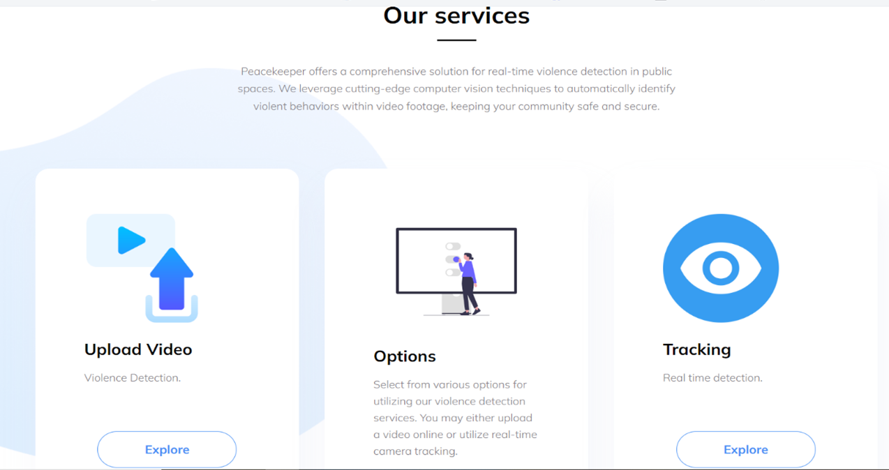
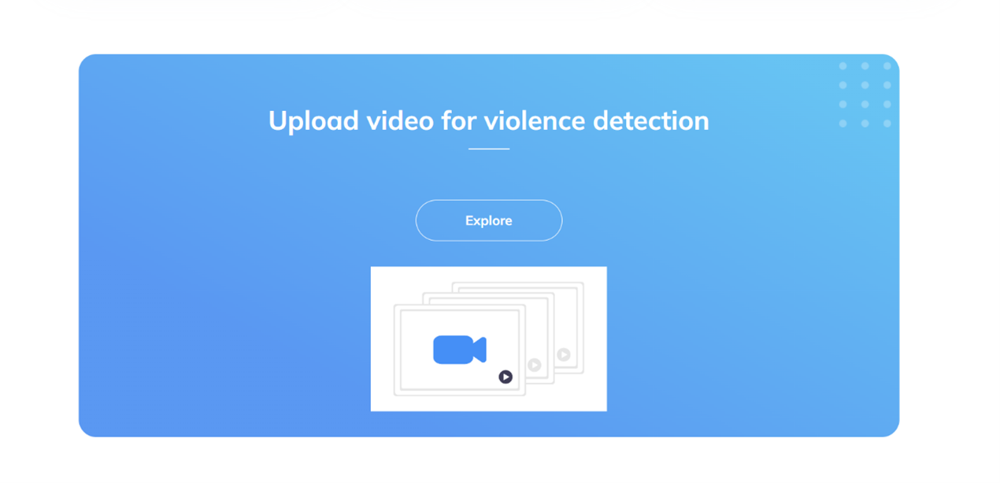
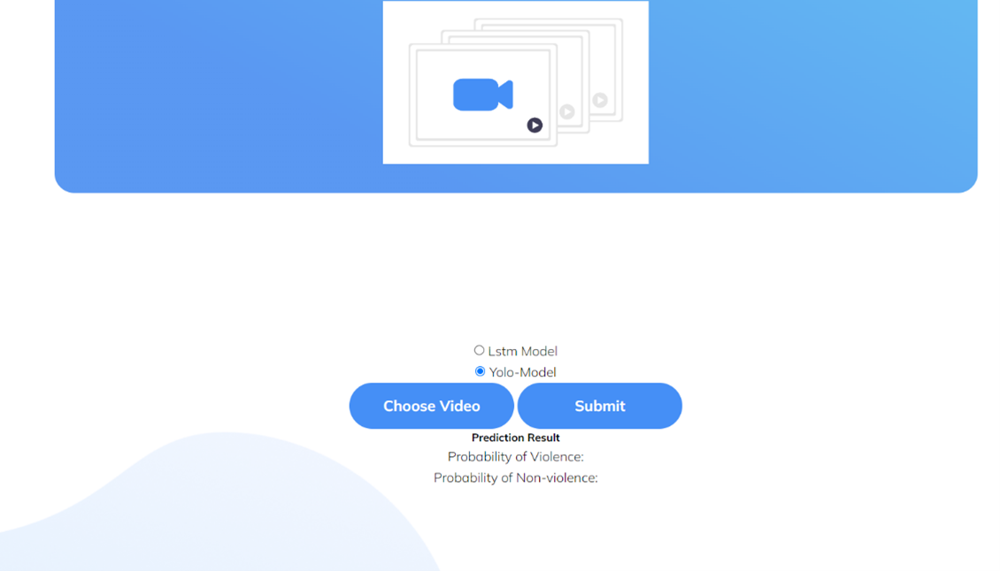
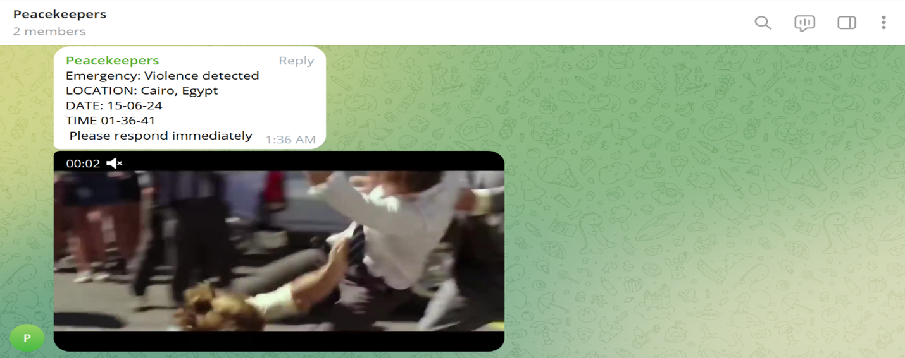

# User Manual

## Home Page
**Intro page:** Welcome to Peacekeeper, your premier destination for advanced violence detection solutions. We utilize cutting-edge technology to enhance safety and security in public spaces and communities.

## Services Offered
### Violence Detection
Peacekeeper offers a comprehensive solution for real-time violence detection using advanced computer vision techniques. This service ensures immediate identification of violent incidents in video footage.

### Real-Time Tracking
Experience real-time detection capabilities through our platform. Choose between uploading video files or utilizing live camera feeds for instant monitoring.

## Upload Video
### Upload Video for Violence Detection
Make sure the video size is not less than 5 seconds.

### Choose Model for Violence Detection
Choose between two models depending on your needs:

- **YOLO Base Model:**
  - Pros: High confidence
  - Cons: Heavy model (slow)
  
- **LSTM Model:**
  - Pros: Light model (fast)
  - Cons: Less confidence

## Real-Time Camera Tracking
Initiate real-time surveillance by opening your camera feed directly through our platform. Monitor live events and receive instant alerts for any detected violence.

## Telegram Bot Alerts
Peacekeeper offers an integrated Telegram bot feature for instant alerts. When violence is detected through real-time tracking or video upload, the bot sends an alert message with the following details:

- **Location:** The detected location of the incident.
- **Time:** The exact time the violence was detected.
- **Date:** The date of the detection.

---

This user manual provides detailed instructions on navigating and utilizing the Peacekeeper platform, including the home page, services offered, uploading videos, real-time tracking, and Telegram bot alerts.

